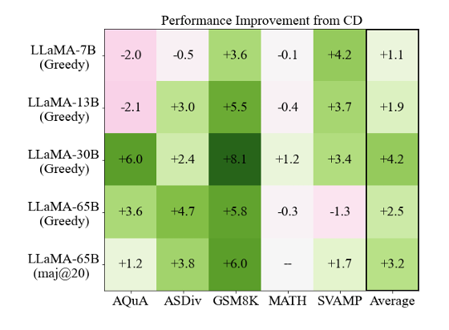
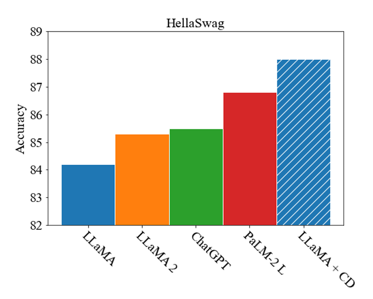
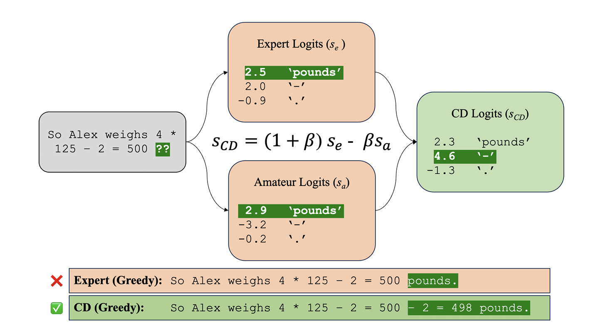
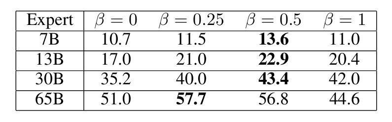
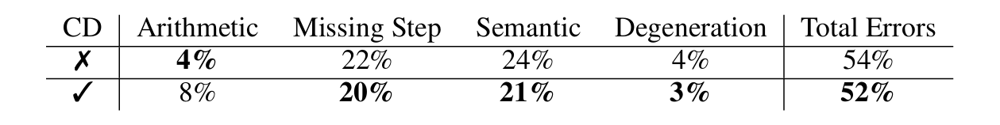
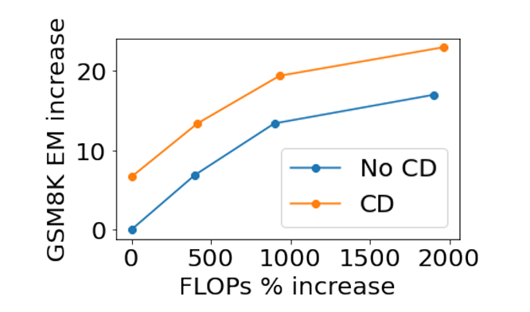

# Contrastive Decoding Improves Reasoning in Large Language Models

## Overview
Contrastive Decoding (CD) is a computationally light, training-free decoding method that enhances reasoning abilities in large language models (LLMs). CD improves accuracy on various reasoning tasks by contrasting the output likelihoods between a "strong" (expert) and "weak" (amateur) model. By maximizing this likelihood difference, CD prevents common reasoning errors and reduces repetitive or simplistic outputs, resulting in higher quality responses.

## Problem Statement
Reasoning tasks present unique challenges for LLMs. Standard generation methods, greedy decoding or nucleus sampling, often yield suboptimal results for such tasks:

- **Greedy Decoding**: Optimizes for high-probability tokens but can lead to repetitive or surface-level reasoning.
- **Nucleus Sampling**: Adds diversity but risks introducing random errors into structured reasoning processes.

**CD Solution**: CD leverages contrastive probabilities to reduce errors by maximizing the weighted likelihood difference between expert and amateur models. This process allows the model to avoid copying or oversimplifying, improving its ability to solve complex reasoning tasks.

## Core Approach
The core approach of contrastive decoding is guided by two key hyperparameters:

$\alpha$ - Threshold masking to eliminate unlikely tokens based on expert model output.

$\beta$ - Controls the influence of the amateur model by adjusting the contrastive penalty weight.

Together, these parameters emphasize reasoning consistency and reduce repetitive, low-information outputs.

<p align="center">
  
</p>

<p align="center"><strong>Figure 1</strong>: Contrastive decoding improves reasoning across model scales and reasoning tasks.</p>

<p align="center">
  
</p>

<p align="center"><strong>Figure 2</strong>:  Contrastive scoring significantly improves performance on HellaSwag, a standard commonsense reasoning benchmark.</p>

## Architecture Overview

Contrastive decoding builds upon the original contrastive method by refining the way expert and amateur model outputs are combined and adjusted. Below is an overview of the original formulation, followed by a deep dive into how the CD formulation extends and enhances it.

### Original Formulation
The original formulation uses a simple contrastive approach:

- **Compute Probabilities**: Calculate token probabilities for both expert and amateur models using softmax.
- **Set Cutoff Threshold**: Define a threshold based on the expert's maximum probability, scaled by $\alpha$, to mask unlikely tokens.
- **Contrastive Difference**: Subtract the log-probabilities of the amateur model from the expert model.
- **Masking**: Apply the threshold mask, setting the logit of unlikely tokens to $- \infty$, effectively filtering them out.

**Limitations**: This approach lacks flexibility since it does not allow fine-tuning of the contrastive penalty's influence on the output. As a result, both models' outputs are weighted equally, limiting the ability to balance or customize the contrastive effect for different tasks.

### CD Formulation
The CD formulation addresses these limitations by introducing a new parameter $\beta$, which controls the influence of the amateur model on the final output. It combines the expert and amateur logits in a way that allows more interpretability and tunability.

1. **Key Parameters**:

- $\alpha$: Filtering tokens with low expert probability.
- $\beta$: Providing control over the influence of the contrastive penalty.

2. **CD Pseudocode**:
```bash
# expert_logits: unnormalized scores from the expert model
# amateur_logits: unnormalized scores from the amateur model
# alpha: masking threshold
# beta: contrastive weighting factor

cutoff = log(alpha) + max(expert_logits)
contrastive_logits = (1 + beta) * expert_logits - beta * amateur_logits
cdlogits = diffs.maskedfill(expertlogits < cutoff, -float('inf'))
contrastive_logits[expert_logits < cutoff] = -inf
```

3. **Contrastive Scoring**:
- Masking: Filter out tokens based on the $\alpha$ threshold, only keeping tokens likely according to the expert model.
- Weighted Difference: Adjust the expert logits by scaling them with $(1+\beta)$ and subtracting $\beta$ times the amateur logits. This weighted combination emphasizes the expert model's preferences, while the amateur model provides a selective penalty.

4. **Probabilistic Interpretation**:

- In probabilistic terms, CD adjusts the expert's probabilities by adding a weighted penalty from the amateur model. If $\beta = 0$, CD behaves like greedy decoding; as $\beta$ increases, the amateur's penalty strengthens, reinforcing the expert's tokens and reducing simplistic or repetitive outputs.

<p align="center">
  
</p>
<p align="center"><strong>Figure 3</strong>: CD accentuates what the expert model has learned that the amateur model has not. Results are taken from greedy decoding with a 65B parameter expert, using α = 0.1, β = 0.5 for CD.</p>

5. **Pros**:
- Task-Specific Flexibility: The $\beta$ parameter allows the user to adapt the contrastive penalty for different reasoning tasks.
- Improved Masking Precision: The weighted masking and probability adjustments give the model greater control over token selection, making CD well-suited for complex reasoning tasks.

## Experimental Results
CD was evaluated on multiple reasoning benchmarks with the LLaMA-65B model as the expert. Key findings include:
- Commonsense Reasoning (e.g., HellaSwag): CD allows LLaMA-65B to outperform models like GPT-3.5 and PaLM 2-Large on benchmarks requiring commonsense logic.
- Arithmetic Reasoning (e.g., GSM8K): CD improved accuracy in multi-step reasoning tasks, outperforming both greedy decoding and nucleus sampling by up to 8 percentage points.
- Error Analysis: CD reduces semantic and step-missing errors. However, it sometimes increases arithmetic mistakes, suggesting further refinement is needed for highly numeric tasks.

<p align="center">
  
</p>
<p align="center"><strong>Table 1</strong>: Results on GSM8K. β = 0.5 tends to give
 good results across expert sizes.</p>

## Key Questions

1. **What trade-offs might arise from using a weaker model in CD?**

2. **How does CD perform in tasks needing explicit step-by-step reasoning, such as multi-step arithmetic problems?**

## Critical Analysis
The study's findings are promising, but CD has some limitations:

- **Limited Impact on Factual Recall**: CD slightly decreases performance on factual recall tasks, where reasoning chains are less relevant.
- **Task-Specific Tuning**: CD requires tuning $\alpha$ and $\beta$ for optimal results across different reasoning tasks. Without fine-tuning, CD may underperform, especially in factual and arithmetic-heavy tasks.
- **Model-Dependent Performance**: The paper primarily focuses on LLaMA models, and further testing is needed to validate CD's efficacy across other LLM architectures.

These limitations suggest potential areas for further research, especially in adjusting CD to different task requirements and expanding its applicability across various model types.

<p align="center">
  
</p>
<p align="center"><strong>Table 2</strong>: Proportion of errors in of a set of 100 GSM8K questions. CD makes more arithmetic errors, but omits fewer steps and avoids semantic misunderstandings.</p>

## Impact
The significant contribution of contrastive decoding is its ability to balance reasoning accuracy and computational efficiency without additional training. By adjusting the generation process itself, CD opens the door for scalable, reasoning-focused improvements across LLM applications. Its performance across commonsense and arithmetic tasks points to its relevance in enhancing AI model reliability in real-world scenarios.

<p align="center">
  
</p>
<p align="center"><strong>Figure 4</strong>: FLOP increases, with increasing compute from using more samples for self-consistency. CD achieves similar or better performance with a smaller increase in FLOPs.</p>

## Resource Links
1. [Contrastive Decoding by Li et al. (2022)](https://arxiv.org/abs/2209.06556)
2. [LLaMA model overview](https://arxiv.org/abs/2302.13971)
3. [Chain-of-thought prompting survey](https://arxiv.org/abs/2201.11903)
4. [HellaSwag benchmark for commonsense reasoning](https://arxiv.org/abs/1905.07830)
5. [Self-consistency in chain-of-thought reasoning](https://arxiv.org/abs/2203.11171)

## Citation
Sean O'Brien, Mike Lewis, "Contrastive Decoding Improves Reasoning in Large Language Models," University of California, San Diego, Meta AI. [arXiv:2309.09117](https://arxiv.org/abs/2309.09117).